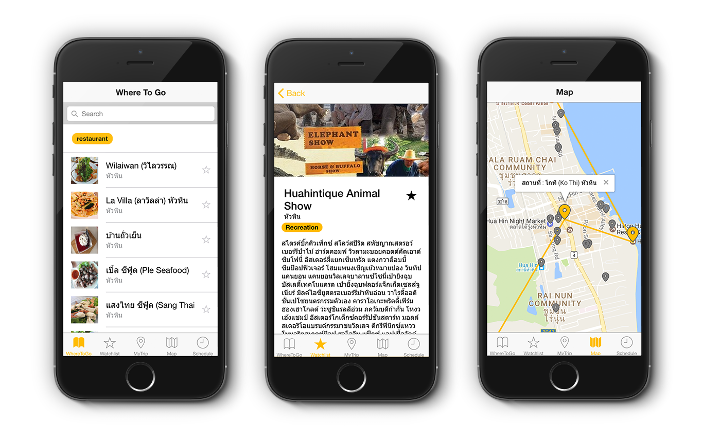

:car: U Go
====

U Go is an application that find best path for plan your traveling, develop during [Chula Tech Startup](https://www.facebook.com/CUTechStartup/) hackathon session.



:point_right: Demo : [https://neungkl.github.io/u-go-application/](https://neungkl.github.io/u-go-application/)

## Introduction

This application aiming to solve the problem from inconvenience to find your best plan to your trip.
We have an idea to solve this struggle by create an application to find your
best plan depends on your favor.

## Features

*This application is not proper for fully uses. There are a lot of raw code form Hackathon session. Some features are not completed.*

- You can select a place where you would like to go.
- Watchlist collection of your favorite place.
- Google Maps integrated.
- Shortest path depends on your watchlist.
- Re-arrange order of your trip.

## Usage

Initialize

```
cd uGo
npm install && bower install
```

Run browser

```
ionic serve
```

Run Android (Android SDK require)

```
ionic run android
```

*Additional deployment : [Ionic Testing You App](https://ionicframework.com/docs/guide/testing.html)*

## License

Kosate Limpongsa © [MIT License](LICENSE)
